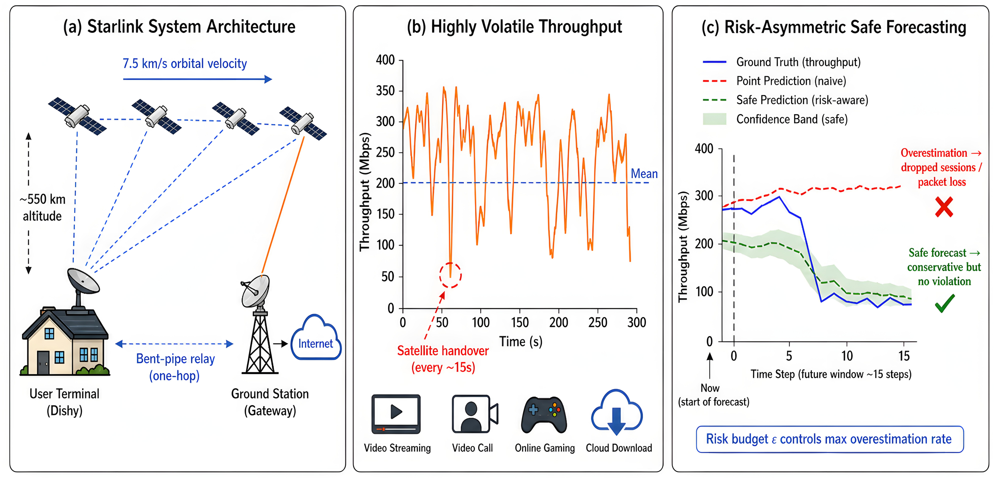
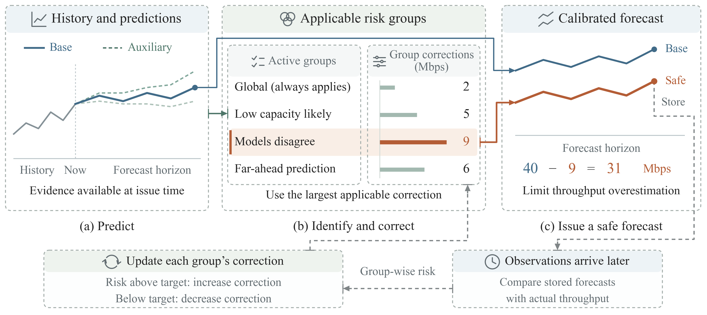
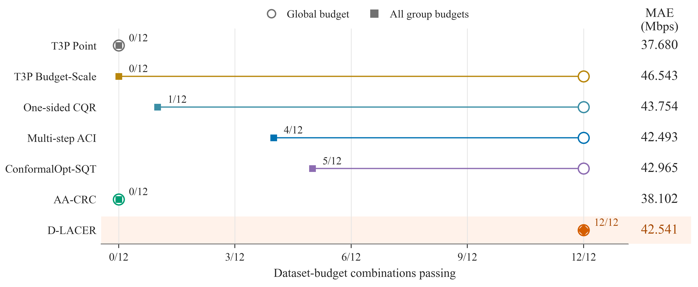
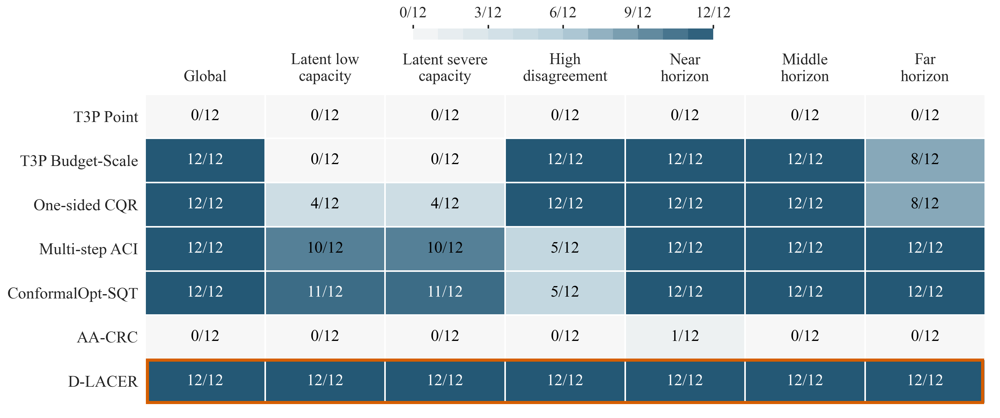

# D-LACER

### Delayed Latent-State Adaptive Conditional Risk Control

**Conditional safety for multi-step Starlink throughput forecasts under delayed feedback.**

[](https://arxiv.org/abs/2605.09508)
[](https://www.python.org/)
[](LICENSE)

**English** | [中文](README_zh.md)

## Overview

**D-LACER** is a backbone-agnostic safety layer for multi-step throughput
forecasting. It discovers latent capacity states from information available at
forecast time, represents safety requirements through overlapping conditional
risk groups, and updates a separate one-sided correction for each group when
delayed outcomes mature. A maximum-correction rule coordinates all active
requirements without summing conservative margins.

Across three public Starlink traces and four risk budgets, D-LACER achieves
**12/12 all-group compliance**, compared with **5/12** for the strongest online
baseline in the study, while retaining comparable forecasting accuracy.

## Background and Motivation

Starlink connects user terminals through rapidly moving low-Earth-orbit
satellites. Satellite motion, handovers, link geometry, traffic load, and
environmental conditions jointly produce large short-term capacity variations.
Accurate throughput forecasts are therefore valuable to admission control,
adaptive streaming, congestion control, and bandwidth reservation.

Conventional point predictors are commonly optimized with symmetric errors
such as MAE or RMSE. In network operation, however, the two error directions
have different consequences. **Overestimating** available throughput can cause
resource over-admission, packet loss, and service violations, whereas
**underestimating** it produces a conservative allocation with lower
utilization. Safe forecasting should therefore preserve useful accuracy while
keeping the frequency of harmful overestimation within an application-defined
risk budget.

An average, or marginal, risk budget is still incomplete. Violations can remain
concentrated in latent low-capacity states, high-disagreement windows, or distant
forecast horizons even when the aggregate budget is met. Moreover, a 15-step
forecast receives its complete supervision only after the future window has
elapsed. The resulting problem is **conditional risk control over overlapping
groups under delayed feedback**, which motivates D-LACER.

<p align="center">
  
</p>

<p align="center"><em>Starlink mobility creates volatile throughput, while the asymmetric cost of forecasting errors calls for risk-budgeted safe prediction.</em></p>

## Method

<p align="center">
  
</p>

<p align="center"><em>D-LACER routes each forecast into overlapping issue-time risk groups and updates their safety corrections after delayed feedback arrives.</em></p>

D-LACER turns an existing multi-step predictor into a conditionally safe
forecasting system through four components:

1. **Issue-time representation.** Historical context, auxiliary forecast
   shapes, and expert disagreement are summarized without future targets.
2. **Latent-state routing.** Two learned routers identify likely low-capacity
   and severe-capacity windows. These groups overlap with high-disagreement and
   near-, mid-, and far-horizon groups.
3. **Delayed group control.** Historical residuals initialize one-sided group
   corrections. Each correction is updated only when the corresponding target
   window becomes observable.
4. **Maximum aggregation.** Each forecast element uses the largest correction
   among its active groups, satisfying simultaneous safety requirements with a
   single scalar adjustment.

The implementation accepts forecasts from any backbone. This repository also
includes a compact horizon-wise XGBoost point/quantile bank for an end-to-end
reference pipeline.

## Results

The table summarizes the principal comparison averaged over Chicago,
Osnabrueck, and Victoria at four overestimation budgets. **All-group Pass**
requires every one of the seven conditional groups to satisfy the budget.

| Method | Global Pass | All-group Pass | MAE |
|:--|--:|--:|--:|
| T3P Budget-Scale | 12/12 | 0/12 | 46.543 |
| One-sided CQR | 12/12 | 1/12 | 43.754 |
| Multi-step ACI | 12/12 | 4/12 | **42.493** |
| ConformalOpt-SQT | 12/12 | 5/12 | 42.965 |
| **D-LACER** | **12/12** | **12/12** | 42.541 |

<p align="center">
  
</p>

<p align="center"><em>Marginal compliance alone can conceal conditional violations; D-LACER maintains all-group compliance across all evaluated dataset-budget combinations.</em></p>

<details>
<summary><strong>Conditional group breakdown</strong></summary>

<br>

<p align="center">
  
</p>

The seven groups cover the global stream, two latent capacity states, high
forecast disagreement, and three forecast-distance ranges.

</details>

## Repository Structure

```text
D-LACER/
├── assets/                  # Method and result figures
├── configs/paper.json       # Paper-aligned default configuration
├── data/README.md           # Dataset sources and preparation protocol
├── scripts/
│   ├── prepare_starnet.py   # Trace cleaning and window construction
│   ├── run_demo.py          # Fast synthetic-stream demonstration
│   └── run_experiment.py    # End-to-end Starlink experiment
├── src/dlacer/
│   ├── controller.py        # Delayed projected group controller
│   ├── groups.py            # Latent routing and overlapping groups
│   ├── features.py          # Target-free issue-time features
│   ├── forecast.py          # XGBoost point/quantile forecast bank
│   ├── data.py              # Dataset processing and temporal splits
│   └── metrics.py           # Accuracy and one-sided safety metrics
└── tests/                   # Core controller and preprocessing tests
```

### Paper-to-Code Map

| Method component | Implementation |
|:--|:--|
| Issue-time representation | `src/dlacer/features.py` |
| Latent capacity-state routing | `src/dlacer/groups.py::build_latent_risk_groups` |
| Residual initialization and delayed projected updates | `src/dlacer/controller.py::DLACERController` |
| Least-conservative maximum aggregation | `src/dlacer/controller.py::DLACERController.run` |
| Starlink windowing and purged temporal splits | `src/dlacer/data.py` |

## Installation

```bash
git clone https://github.com/luopeng69131/D-LACER.git
cd D-LACER

python -m venv .venv
source .venv/bin/activate
pip install --upgrade pip
pip install -e .
```

Run the synthetic delayed-feedback example:

```bash
python scripts/run_demo.py
```

The command prints overall safety metrics, group-wise overestimation rates,
and the empirical budget decision for every conditional group.

## Starlink Experiment

The public traces and their official download links are documented in
[`data/README.md`](data/README.md). After following the
[StarNet data pipeline](https://github.com/ConnectedSystemsLab/StarNet) to
obtain a regional `dataset_tp_sat.pkl`, construct the forecasting windows:

```bash
python scripts/prepare_starnet.py \
  --input /path/to/dataset_tp_sat.pkl \
  --output data/processed/chi.npz \
  --name chi \
  --step-len 46
```

Then train the reference forecast bank and run D-LACER:

```bash
python scripts/run_experiment.py \
  --data data/processed/chi.npz \
  --budget 0.35 \
  --output outputs/chi_b35.npz
```

The experiment stores predictions and correction trajectories in `.npz`
format and writes the aggregate and group-wise metrics to a companion JSON
file. Paper-aligned settings for all three regions and four budgets are listed
in [`configs/paper.json`](configs/paper.json).

## Using D-LACER with Another Backbone

```python
from dlacer import DLACERController, build_latent_risk_groups

groups = build_latent_risk_groups(
    context=issue_time_context,                    # (windows, features)
    point_prediction=backbone_prediction,          # (windows, horizon)
    candidate_predictions=auxiliary_predictions,  # (experts, windows, horizon)
    target=observed_throughput,
    initialization_end=initialization_end,
)

result = DLACERController().run(
    base_prediction=backbone_prediction,
    target=observed_throughput,
    groups=groups,
    budget=0.35,
    initialization_end=initialization_end,
    evaluation_start=evaluation_start,
    feedback_delay=feedback_delay,
)

print(result.metrics)
print(result.group_passes(0.35))
```

## Citation

If this project supports your research, please cite:

> Xie H, Zhang C, Luo P, et al. Risk-aware safe throughput forecasting for Starlink networks. *arXiv preprint arXiv:2605.09508*, 2026.

```bibtex
@article{xie2026risk,
  title   = {Risk-Aware Safe Throughput Forecasting for Starlink Networks},
  author  = {Xie, Hongjun and Zhang, Chao and Luo, Pengcheng and others},
  journal = {arXiv preprint arXiv:2605.09508},
  year    = {2026}
}
```

## Acknowledgements

The experiments build on the public Starlink measurements and processing tools
from [StarNet](https://github.com/ConnectedSystemsLab/StarNet). We thank its
authors for making the measurement artifacts available to the community.

## License

This project is released under the [MIT License](LICENSE).
